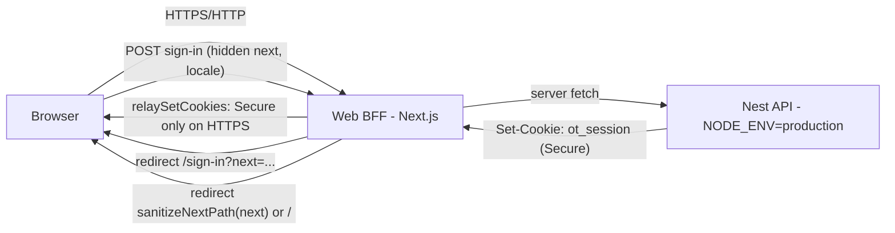

# Fix dashboard redirect after sign-in

## 📝 TLDR

Support staff signing in to the web panel are supposed to land on the shared-inbox workspace at `/` (the product's "dashboard"), but on plain-HTTP deployments the sign-in succeeds and the browser is bounced straight back to the sign-in form, and everywhere the destination the user originally wanted is lost. Root cause: the BFF relays the API's `ot_session` cookie verbatim — including its `Secure` attribute — onto non-HTTPS origins where browsers silently drop it. This spec proposes: (1) relay-adapt the cookie attributes to the web origin, (2) preserve the intended destination across the sign-in detour via a validated `next` parameter, and (3) stop the sign-in form from resetting the user's locale to English.

## Resolved assumptions (autonomous defaults)

| # | Question | Applied default | Why | Confirm? |
|---|----------|-----------------|-----|----------|
| Q1 | Does "dashboard" mean a `/dashboard` route that should exist? | No — keep `/` as the authenticated landing; do not introduce a `/dashboard` route | No route or string named "dashboard" exists anywhere in `src/` or `messages/` (repo-wide grep); `/` renders the workspace (`src/app/page.tsx:23-37`) and N02 keeps analytics dashboards a non-goal. Creating a route would invent surface for a naming ambiguity | reversible |
| Q2 | Where to fix the `Secure`-cookie breakage: BFF relay or an env-configurable API flag? | Adapt the attribute at the relay in `relaySetCookies` — keep `Secure` only when the browser connection is HTTPS | The API's `Secure` default is contractual (ADR-0002); the relay already exists to adapt the API's Set-Cookie for the browser (2583129). Behavior-preserving on `localhost`/HTTPS; no API or compose change. Env-flag alternative recorded as rejected | reversible |
| Q3 | Introduce an intended-destination (`next`) parameter? | Yes — minimal same-origin relative-path `?next=` on the auth bounce, defaulting to `/` when absent or invalid | Deep-link → sign-in currently dumps every user at `/`; a validated relative path adds no new public contract and is standard practice. "Also honor it on sign-up/accept-invite" — yes, same one-line rule, no extra surface | reversible |
| Q4 | How to fix the locale stomp — remove the hidden input, or read the session profile's locale? | Pass the current `ot_locale` value from the server page into `AuthCard` as a prop (replacing the hardcoded `value="en"`) | Smallest change honoring ADR-0004 ("user locale = user profile field", cookie-driven in MVP); no new API call; `accept-invite` keeps its form-provided locale because there the user genuinely chooses on the form | reversible |

No assumption above requires human confirmation; all are reversible and none weaken session security (Q2 strips `Secure` only on origins where browsers refuse to store it anyway — the cookie's wire exposure is unchanged).

## 📝 Problem Statement

The reported symptom — "redirection to the dashboard after sign-in does not work correctly" — decomposes into three code-verified defects on `origin/main` (9724acb). There is no `/dashboard` route: the authenticated landing is `/`, which renders the shared-inbox workspace (`src/app/page.tsx:23-37`) and re-routes platform admins to `/admin` (`src/app/page.tsx:21`). All three auth actions redirect to `/` on success (`src/app/actions/auth.ts:30,54,94`).

Commit 2583129 already fixed the original breakage — the API's `ot_session` Set-Cookie never reached the browser because a Server Action's internal `fetch` cannot set browser cookies — by adding `relaySetCookies` (`src/lib/api-client.ts:51-90`). Three defects remain.

**D1 — Access-blocking: the relayed session cookie carries `Secure` onto HTTP origins.**
The API sets `ot_session` with `secure: process.env.NODE_ENV === 'production'` (`api/src/auth/auth.service.ts:203`; same in `api/src/auth/guards.ts:16`), which is the ADR-0002 contract (`ot_session` httpOnly+Secure+SameSite=Lax). The documented Docker deployment always runs the API with `NODE_ENV: production` (`docker-compose.yml:37`, `api/Dockerfile:16`), so in the default topology the login response cookie always carries `Secure`. `relaySetCookies` copies attributes verbatim (`src/lib/api-client.ts:73`), and the web panel is served over plain HTTP (`docker-compose.yml` maps `${WEB_PORT:-3000}:3000` with no TLS; `APP_URL` defaults to `http://localhost:3000`). Browsers reject `Secure` cookies on non-localhost HTTP origins, so on any LAN-IP/staging/self-host access the chain is: sign-in returns 200 → action redirects to `/` → `/`'s `/v1/auth/me` check fails (`src/app/page.tsx:13`) → redirect to `/sign-in`, which renders the empty form with no error (`src/app/sign-in/page.tsx:14` only redirects when already authenticated). Result: an invisible sign-in loop — the dashboard is unreachable, with no diagnostic shown. It works on `http://localhost` only because Chrome/Firefox treat localhost as a trustworthy origin that may receive `Secure` cookies, which is why the bug hides in daily dogfooding.

**D2 — Intended destination is lost.** Every protected page bounces unauthenticated visitors to bare `/sign-in` without recording where they came from (`src/app/page.tsx:13`, `src/app/settings/page.tsx:15`, `src/app/team/page.tsx:13`, `src/app/knowledge/page.tsx:13`, `src/app/admin/page.tsx:14`), and `signInAction` always redirects to `/` (`src/app/actions/auth.ts:30`). A user whose session expired inside `/settings` or `/knowledge` signs back in and is dumped at the inbox. No `?next=`/`callbackUrl`/`intent` mechanism exists anywhere in `src/` (repo-wide grep for `searchParams|callbackUrl|intent` finds no auth-path usage).

**D3 — Sign-in resets the chosen locale.** `AuthCard` hardcodes `<input type="hidden" name="locale" value="en" />` (`src/components/auth-card.tsx:37`), and all three auth actions write `ot_locale` from that field (`src/app/actions/auth.ts:29,53,93`) — under the comment "store the user's chosen locale". A Polish user who toggled PL on the auth page via `LanguageToggle` (`src/components/auth-chrome.tsx:9-28` → `setLocaleAction`) is flipped back to the English UI right after signing in, contradicting ADR-0004 (locale comes from the session/user choice, not a hardcoded default).

**Brief correction (observed, not inferred):** the brief suspected locale URL prefixes as a redirect-breaker. They do not exist — ADR-0004 rules "URL carries no locale segment in MVP (locale from session)" and `src/i18n/request.ts:12-17` derives the locale solely from the `ot_locale` cookie. The prototype panel `/prototype/support` (`src/app/prototype/support/page.tsx`) is an unauthenticated demo surface that does not participate in the auth redirect path; out of scope here.

## 📝 Proposed Solution

Turn the scattered ad-hoc redirects into one explicit rule, then fix the cookie relay that breaks it.

**Redirect decision rule (proposed behavior):**

1. **Unauthenticated request to a protected page** (`/`, `/settings`, `/team`, `/knowledge`; non-admin on `/admin`) → `redirect('/sign-in?next=<encoded requested path+query>')`. The bounce records where the user wanted to go.
2. **Unauthenticated request to `/sign-in` or `/sign-up`** → render the form (unchanged).
3. **Authenticated request to `/sign-in`/`/sign-up`** → redirect to the sanitized `next` value if present, otherwise `/` (replaces the bare `redirect('/')` at `src/app/sign-in/page.tsx:14` and `src/app/sign-up/page.tsx:13`).
4. **Successful sign-in / sign-up / invite-accept** → redirect to the sanitized `next` if present, otherwise `/`. `/` keeps its existing role-based behavior (platform admin → `/admin`; tenant member → workspace).
5. **Locale is cookie-driven on every branch** (ADR-0004, no URL segments): `ot_locale` survives sign-in instead of being reset (D3 fix), so case 4 lands the user in the language they chose.
6. **Cookie relay adapts to the web origin** (D1 fix): `relaySetCookies` drops the `Secure` attribute when the browser connection is plain HTTP and keeps it on HTTPS — derived from the action request's `x-forwarded-proto` (falling back to `APP_URL`'s scheme). `httpOnly`, `SameSite`, `Max-Age`, `Expires`, and `Path` relay unchanged. The API contract (ADR-0002 Secure default) is untouched.

`next` sanitization (open-redirect guard): accept only values that start with a single `/`, are not `//…` (protocol-relative), and contain no scheme; anything else — including `/sign-in` and `/sign-up` themselves, which would loop — falls back to `/`.

**Alternatives considered:**
- *Env-configurable API cookie flag* (`COOKIE_SECURE=false` in compose): rejected as the primary fix — it changes the documented ADR-0002 default at the API and depends on every self-hoster remembering a setting; the BFF relay is the layer whose job is browser-side adaptation. Can still ship later as defense-in-depth for exotic proxies.
- *Middleware-based route protection* to centralize the per-page auth checks: rejected for this spec — Next.js middleware can only check cookie *presence*, not validity (sessions live in the API's Postgres), so it cannot decide authenticated-vs-unauthenticated correctly. The per-page `apiFetch('/v1/auth/me')` checks stay; this spec only changes their redirect targets.
- *Creating a `/dashboard` route* that redirects to `/`: rejected — adds surface to satisfy a naming assumption (Q1).

## 📝 Architecture

All changes stay inside the existing web BFF layer (`src/lib`, `src/app/**`); no API-service, schema, or contract changes.

- **`src/lib/api-client.ts`** (existing) — `relaySetCookies` gains the origin-aware `Secure` handling. To keep it unit-testable outside Next, the pure pieces move to a framework-free module in `src/lib/` (the pattern of `src/lib/api-response.ts`, which has no `server-only` import and is imported directly by `tests/api-response.test.mjs`): a cookie-attribute parser and `resolveCookieAttributes(proto)`; `api-client.ts` re-exports/wraps them behind `import 'server-only'`.
- **`src/lib/redirect.ts`** (new, framework-free) — `sanitizeNextPath(value: string | undefined): string | undefined` implementing the rule above. Pure; consumed by pages and actions.
- **`src/app/actions/auth.ts`** (existing) — reads `next` from the submitted form (as a hidden field, since Server Actions receive no search params) and redirects through `sanitizeNextPath`; stops overwriting `ot_locale` on sign-in (D3; sign-up/accept-invite keep setting it from the form's real selector).
- **Protected pages** (`src/app/page.tsx`, `settings`, `team`, `knowledge`) (existing) — their `redirect('/sign-in')` calls append `?next=`. `admin/page.tsx` is unchanged (platform-admin surface keeps its own bounce).
- **`src/components/auth-card.tsx`** (existing) — receives `locale` as a prop from the server pages instead of the hardcoded hidden input (D3).

Takeaway: one new pure helper module and touches to five files the 2583129 fix already visited; no new public endpoint, no schema change, no dependency.

All components above are existing; nothing is added to the runtime path except the pure helpers.

## 📝 Data Model

None. No Prisma schema, state-store, or cookie-shape changes: `ot_session` and `ot_locale` keep their names and semantics; only which attributes the relay forwards changes.

## 📝 API Contracts

None changed. `/v1/auth/*` request/response shapes are untouched; the web continues to call them exactly as today (`API-CONTRACT-OUTLINE.md` auth section). The `?next=` query parameter is a web-UI-only contract between the panel's own pages, not a public API.

## 📝 UI/UX

No new screens. The user-visible changes:

- Sign-in from a bounced deep link returns the user to the page they asked for (e.g. `/settings?tab=mailbox`) instead of the inbox.
- On HTTP deployments that previously looped, sign-in now lands on the workspace. No error copy is added — the loop was silent, and after the fix there is nothing to message about.
- The UI language after sign-in matches the language chosen on the auth pages (PL stays PL).

Accessibility: unchanged; `next` is an invisible form field, no focus or DOM-order effects.

## 📝 Edge Cases & Failure Scenarios

| Scenario | Behavior |
|---|---|
| `next=/settings` but the user is a platform admin without a tenant | `/settings`'s own guard (`src/app/settings/page.tsx:20` → `redirect('/admin')`) routes them on; no loop (that page does not bounce back to sign-in for authenticated users) |
| `next=/admin` for a tenant user | Today `/admin` bounces authenticated non-admins via `/sign-in` to `/` (`src/app/admin/page.tsx:14` → `sign-in/page.tsx:14`). With case 3 honoring `next` this could ping-pong; the sanitizer therefore rejects `next` values equal to `/sign-in`/`/sign-up`, and the implementation must also exclude `/admin` from accepted `next` targets for non-admin flows (simplest: accept it, and change `admin/page.tsx:14` to send authenticated non-admins to `/` directly — one line, removes the pre-existing oddity) |
| `next=https://evil.example` or `next=//evil.example` | Rejected by the sanitizer → `/` |
| API unreachable at sign-in | `apiFetch` throws inside the action → Next error boundary, as today; out of scope (pre-existing, unchanged by this spec) |
| Logout on HTTP origin | The API's `clearCookie` response (`ot_session=; Expires=<past>`) relays as an expired cookie — already deletes correctly; the `Secure` handling must not resurrect it (tests cover this) |
| Stale session mid-navigation | The next server render's `/v1/auth/me` check bounces to `/sign-in?next=<current path>`; after re-sign-in the user returns where they were — this is the D2 payoff |
| Reverse proxy that does not set `x-forwarded-proto` | Fall back to `APP_URL` scheme (documented in compose as the app's public URL); worst case is today's behavior, never worse |

## 📝 Risks & Impact Review

- **Cookie-handling change (highest care).** `relaySetCookies` is the auth anchor path (ADR-0002). The change is attribute-filtering only, is behavior-preserving on localhost/HTTPS, and is unit-tested against both relays (login sets, logout clears). Rollback is a one-commit revert; no stored state is affected.
- **Security review of Q2:** stripping `Secure` only affects origins where the browser refuses to store the cookie at all — the session's wire exposure (plaintext HTTP) is identical with or without the attribute. The durable fix for production self-hosts is serving the panel over TLS; the spec recommends noting that in the deployment docs but does not change any default.
- **`next` open-redirect surface.** Mitigated by the sanitizer (same-origin relative paths only); tests enumerate the rejected forms. This is the only new user-controllable input.
- **Compatibility surfaces (BACKWARD_COMPATIBILITY.md):** none of the protected surfaces (API `/v1` contract, Prisma schema, `state.json`) are touched.
- Product-direction calls: none — Q1 (no `/dashboard` route) aligns with active non-goal N02 and existing information architecture; no business rule (R01–R05) is implicated.

## i18n implications

None — no new user-facing strings are introduced (the `next` parameter is invisible; no copy changes), so `messages/en.json` and `messages/pl.json` are untouched and `scripts/check-i18n.mjs` stays green. The D3 fix removes an existing violation of ADR-0004's locale-persistence intent; per ADR-0004, locale remains cookie-driven with `en` fallback (`src/i18n/request.ts:16`), and no `[locale]` routing is introduced.

## 🧪 Verification limits (static analysis)

This spec was written from code reading only — the app was not booted and no browser session was exercised in this run. Verified by code: every file:line citation above is on `origin/main` (9724acb) plus commit 2583129's diff. Inferred, not executed: (a) that browsers drop `Secure` cookies on non-localhost HTTP — standard cookie storage semantics (RFC 6265bis §5.5; Chrome/Firefox treat localhost as trustworthy), the mechanism behind D1's loop; (b) that `LanguageToggle` does not visibly switch language until reload (Next server actions do not re-render server components without `router.refresh()`/`revalidate`). Implementation should confirm (a) once against a real HTTP host during QA of Phase 1.

## 📋 Phasing

- **Phase 1 — Session survives sign-in on HTTP (D1):** origin-aware `Secure` relay + extracted pure helpers + unit tests. Independently shippable; removes the access-blocking loop.
- **Phase 2 — Intended destination (D2):** `sanitizeNextPath` helper, `?next=` on protected-page bounces, hidden field + honored redirect in auth actions and auth pages, `/admin` non-admin bounce fix, unit tests. Independently shippable.
- **Phase 3 — Locale persistence (D3):** `AuthCard` locale prop from server pages, stop the `ot_locale` overwrite on sign-in, unit test. Independently shippable.

## 📋 Implementation Plan

Conventions: web tests are the Node built-in runner (`node --test`, `tests/*.test.mjs`, plain imports of framework-free `src/lib/*.ts` modules, hermetic — no network, no real mail); gate is the repo's six-command validation list.

**Phase 1**
1. Extract `parseSetCookieHeader` (pure) and add `resolveRelayOptions(attrs, proto)` into a framework-free `src/lib/` module; port `relaySetCookies` onto them; unit test: login-style cookie relays `httpOnly`/`sameSite`/`maxAge`/`path` always, `secure` only for `proto === 'https'`; logout-style expired cookie relays as expired under both protos. (`npm test` green.)
2. Wire the action request's proto (`headers()` → `x-forwarded-proto`, fallback `APP_URL` scheme) through `relaySetCookies` call sites in `src/app/actions/auth.ts`. Typecheck green.

**Phase 2**
3. Add `src/lib/redirect.ts` with `sanitizeNextPath`; unit test: accepts `/settings`, `/settings?tab=mailbox`, `/`; rejects/`undefined`→`/` for `https://…`, `//…`, `javascript:`, `/sign-in`, `/sign-up`, empty. (`npm test` green.)
4. Protected pages append `next` to their `/sign-in` bounce; auth pages/actions carry and honor it; `admin/page.tsx` sends authenticated non-admins to `/`. Typecheck + `npm test` green.

**Phase 3**
5. `AuthCard` takes `locale` prop; `sign-in`/`sign-up` pages pass the current `ot_locale`; `signInAction` no longer writes `ot_locale` (sign-up/accept-invite keep it). Unit test the action logic where feasible; manual: toggle PL on `/sign-in`, sign in, UI stays PL. Full gate green.

Each step leaves the app working and the validation gate green.
