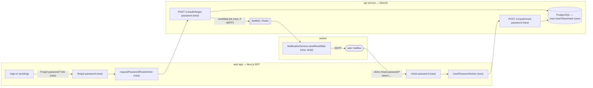

# Password recovery (forgot password → confirm reset)

## 📝 TLDR

Tenant users who forget their password are permanently locked out today: e-mail+password is the only authentication (ADR-0002) and there is no recovery path anywhere in the product. Proposed (future behavior): a self-serve reset flow — a "Forgot password?" entry on the sign-in screen, a reset-request endpoint that never reveals whether an account exists, a single-use time-limited token delivered by the worker over SMTP, and a confirm screen that sets the new argon2id password, revokes existing sessions, and signs the user in. Out of scope: change-password-while-signed-in, SSO, MFA.

## Resolved assumptions (autonomous defaults)

| # | Question | Applied default | Why | Confirm? |
|---|----------|-----------------|-----|----------|
| Q1 | Dedicated reset-token fields vs reuse `verifyToken` | Dedicated additive fields: `User.resetTokenHash` + `User.resetTokenExpiresAt` | `verifyToken` already serves two flows (e-mail verification `POST /auth/verify`, invite setup `POST /auth/accept-invite`); a third use creates real collisions (pending invite + concurrent reset both need the one column). Additive migration, fully reversible | reversible |
| Q2 | Platform admins included? | Tenant users only; platform-admin self-serve reset deferred | Admins are few and operator-provisioned (api/src/scripts/create-platform-admin.ts); a locked-out operator can restore access directly. Smallest scope that ships the user-facing capability | reversible |
| Q3 | Session handling after reset | Invalidate **all** the user's sessions (`Session.deleteMany({ userId })`), then auto sign-in on the reset device (mirrors `accept-invite`) | Revocation closes a stolen-session hole — the main reason resets exist; auto sign-in matches the shipped accept-invite UX, so no new session-issuance pattern is invented | reversible |
| Q4 | Abuse guard | Small in-process fixed-window limiter (per e-mail + per IP) on both endpoints; no new dependency, no Redis requirement | A 256-bit single-use token already makes guessing infeasible; the limiter only stops mail-bombing. Per-instance limiting is a documented MVP limitation; global coordination is deferred (product brief D06 moves coordination to Postgres later) | reversible |
| Q5 | No-SMTP fallback | Never log the reset token. `POST /auth/forgot-password` still returns the identical generic response; the API logs an operator warning **without** the token; SMTP-less deployments recover accounts operator-assisted | Reset tokens grant full account access — unlike the low-value verify token, they must not enter plaintext logs (business rule R03 spirit: credentials never surface in logs). Deviates deliberately from the verify-mail precedent; QA/dev exercise the full flow via the `verify-mail` compose profile (Mailpit) | reversible |

## 📝 Problem Statement

A user whose password is forgotten has zero recovery paths. Sign-in accepts exactly e-mail+password (`POST /auth/login`); there is no reset endpoint, no token model, no UI. Consequences:

- A locked-out team member is fully blocked — no sign-in, no work. For an agency's support team this is a stop-everything event, and priority-high is warranted for that reason.
- The operator (tenant owner or self-host admin) has no tooling either; recovery means direct database surgery on `passwordHash`.
- Market baseline: every comparable product (Intercom, Zendesk, GitHub) treats e-mailed single-use reset links as table stakes; the distinctive part here is only fitting the house patterns (session auth, worker mail, en/pl).

## 📝 Proposed Solution

Two new pre-auth endpoints in the existing `AuthModule` plus two new pages in the web app, with delivery through the existing worker mail pipeline:

1. `POST /v1/auth/forgot-password` `{email}` → always `{data:{ok:true}}`, whether or not the account exists (no user enumeration). When the account exists and system SMTP is configured, a reset job is queued; the worker e-mails a link `{APP_URL}/reset-password?token=…`.
2. The token is a 256-bit random value (`generateToken(32)`), stored only as a SHA-256 hash with a 60-minute expiry. Single-use: the confirm step nulls the hash before any other action.
3. `POST /v1/auth/reset-password` `{token, password}` → validates the token (exists, unexpired), rehashes the new password with argon2id, clears `resetTokenHash`/`resetTokenExpiresAt` **and** any pending `verifyToken`, sets `emailVerified: true` (mailbox ownership just proven), deletes all of the user's sessions, issues a fresh session cookie, and returns the same `{user, tenant}` payload as login.
4. Web: `/forgot-password` (e-mail form + "request sent" state) and `/reset-password?token=…` (new password + confirm form, invalid-token state), reached from a new "Forgot password?" link on the sign-in card. All strings in both `messages/en.json` and `messages/pl.json`.

Alternatives considered and rejected: reusing `verifyToken` (collision-prone, Q1); magic-link-only sign-in (replaces the auth model, far larger blast radius); security questions or SMS secondary channels (anti-patterns — weak and out of scope); logging the token when SMTP is absent (rejected, Q5).

Research note (market leaders): the adopted defaults match standard practice — enumeration-safe request responses, single-use hashed tokens with ≤1 h expiry, session revocation on reset, and request rate limiting. Deliberately skipped complexity: password-strength meters beyond the existing 10-character minimum, breached-password checks, and admin-initiated forced resets.

## 📝 Architecture

Existing components reused: `AuthModule` + `SessionGuard` patterns (api/src/auth/), `Producer.enqueueResetMail` modeled on `enqueueVerifyMail` (api/src/worker/producer.ts), `NotificationService.sendResetMail` with the en/pl string table (api/src/worker/notifications.service.ts), server-actions + `AuthCard`-style pages (src/app/actions/auth.ts, src/components/auth-card.tsx), `apiFetch`/`relaySetCookies` for the BFF cookie relay.



Takeaway: the reset flow threads through every tier the login flow already uses — no new infrastructure, only new handlers on existing rails; the queue leg is optional and degrades silently (identical API response) when SMTP or Redis is absent.

## 📝 Data Model

Additive Prisma migration (via `api/scripts/create-migration.mjs`; never edit an applied migration):

```prisma
model User {
  // existing fields unchanged…
  resetTokenHash     String?
  resetTokenExpiresAt DateTime?
  // @@index([resetTokenHash]) — lookup is by hash
}
```

- Token at rest: `sha256(token)` hex — the raw 256-bit token exists only in the e-mailed URL and never in the database or logs (R03 spirit; no hand-rolled crypto, only Node `crypto`).
- `PlatformAdmin` is untouched (Q2).
- No new PII; the token hash is an access credential and gets the same treatment as `passwordHash` (never selected into API responses).
- Rollback: the migration is additive (nullable columns + index); reverting the code leaves harmless nullable columns.

## 📝 API Contracts

New routes under the protected `/v1` surface — additive, existing routes untouched; responses keep the `{ data }` envelope and `{ code, message, details? }` error shape.

**`POST /v1/auth/forgot-password`** — `{email: string (email)}` (Zod, parsed in the controller/service like `loginSchema`).
- Always → `200 {data:{ok:true}}` with an identical body whether or not the account exists or mail was queued — no enumeration oracle. (A limiter trip returns `429` for any body, which leaks nothing about the account either.)
- Validation failure → `400 VALIDATION_ERROR` (global Zod filter).
- Limiter excess → `429 {code:'TOO_MANY_REQUESTS'}` (new additive error code).

**`POST /v1/auth/reset-password`** — `{token: string, password: string (min 10, max 200 — the sign-up rule from `signupSchema`)}`.
- Success → `200 {data:{user:{id,email,role,locale},tenant:{id,name,slug}}}` + fresh `ot_session` cookie (same shape as `POST /auth/login`).
- `400 INVALID_TOKEN` — unknown, expired, or already-used token (single message for all three; no token-state oracle).
- `401 ACCOUNT_DEACTIVATED` / `401 TENANT_SUSPENDED` — parity with `accept-invite`.
- `400 VALIDATION_ERROR` — schema failures.

Account lookup mirrors login exactly (`findFirst({ where: { email } })`): where the same e-mail exists in several tenants, reset reclaims the account login would sign into — a documented MVP quirk this spec inherits rather than changes.

## 📝 UI/UX

Three touch points, all in the existing `auth-page` visual language (`AuthCard`, `auth-chrome`), all i18n'd en/pl (ADR-0004):

1. **Sign-in card** — new `forgotPassword` link under the password field (`src/components/auth-card.tsx`, `mode === 'sign-in'` only). Existing keys untouched (protected surface); only additive `auth.*` keys.
2. **`/forgot-password`** — e-mail + submit (`requestPasswordResetAction` server action). On any 2xx/4xx-except-validation outcome: a neutral sent-confirmation state ("If an account exists for this address, a reset link is on its way") — the UI must not leak existence either. Limiter `429` shows a retry-later error.
3. **`/reset-password?token=…`** — new password + confirm-password fields; client checks the pair matches (`passwordMismatch`), server enforces the 10-char minimum (same rule as sign-up, hint text `passwordHint` reused). Invalid/expired/used token → the `invalidResetToken` error state (parity with `invalidInviteToken` UX on `/accept-invite`). Success → redirected to `/` signed in (cookie relayed like `acceptInviteAction`).

Accessibility: `role="alert"` on errors, `autocomplete="email"` / `autocomplete="new-password"`, labels bound exactly like the existing auth forms. Mockups: `assets/password-recovery/mockup-01-forgot-password.html`, `mockup-02-forgot-sent.html`, `mockup-03-reset-password.html` (+ current-state screenshots referenced from the spec PR evidence comment).

## 📝 Edge Cases & Failure Scenarios

| Scenario | Behavior |
|---|---|
| Unknown e-mail requests reset | Identical `{data:{ok:true}}`; no job queued; nothing observable from outside |
| Deactivated user / suspended tenant requests reset | Request response stays identical; `reset-password` rejects with `ACCOUNT_DEACTIVATED` / `TENANT_SUSPENDED` |
| Token expired (60 min) or already used | `400 INVALID_TOKEN`; user restarts from `/forgot-password` |
| Repeated reset requests | Each request issues a fresh token superseding the previous hash (old link dies); limiter caps mail-bombing |
| User has a pending invite / unverified e-mail | Reset clears `verifyToken` too (old invite/setup link dies), sets `emailVerified: true`; `invited` flag cleared so `accept-invite` can't re-fire on the stale token |
| Same e-mail in two tenants | `findFirst` parity with login — resets the account login would reach (documented MVP quirk) |
| Redis down (queue unavailable) | Producer degrades (existing pattern); response still identical `{data:{ok:true}}`; mail simply never sends |
| System SMTP unconfigured | No job queued (producer returns false as today); operator warning log **without** token; no user-visible difference |
| Worker delivery fails after retries | BullMQ `attempts: 3` exhausts; job failure logged; user can re-request after the limiter window |
| Concurrent resets from two devices | Last confirm wins; the loser's token is dead — single-use is enforced with an atomic conditional write (`updateMany({ where: { id, resetTokenHash } })`, count 0 ⇒ `INVALID_TOKEN`), never a check-then-clear race |

## 📝 Risks & Impact Review

- **Protected surfaces (BACKWARD_COMPATIBILITY.md):** additive only — new `/v1` routes, nullable columns, new `auth.*` i18n keys, one new error code (`TOO_MANY_REQUESTS`). Existing session cookie semantics, `setupToken` fallback, and route shapes untouched.
- **Account-takeover surface grows** by design: mitigations are hashed single-use tokens, 60-minute expiry, full session revocation, no-enumeration responses, and the request limiter. The deliberate non-feature — never logging tokens (Q5) — avoids recreating the classic reset-token-in-logs leak.
- **Rate limiter is per-instance** (in-memory): multi-replica deployments get N× the configured allowance. Accepted MVP limitation; global limiting arrives with Postgres coordination (product-brief D06). Reversible: swap the store, keep the interface.
- **Operators of SMTP-less deployments** lose nothing they had, gain no self-serve recovery either (no channel exists to reach the user); operator-assisted recovery remains manual. Flagged as future work: a small operator CLI for password reset.
- **Rollback:** revert commits; additive migration needs no down-path. No default user-visible behavior changes for users who never touch the flow.

## Decisions in play

Relies on product-brief decisions without superseding any: **D02** (e-mail+password rules the api MVP; this feature is pure ADR-0002 scope), **R03** (secrets/credential handling — extended in spirit to reset tokens: hashed at rest, never logged), and no Non-goal is touched (N01 chat, N02 analytics are unrelated). Business rules R01/R02/R04/R05 unaffected. The brief's owner (Kamil Mastalerz) approves scope; nothing here requires a superseding row.

## 📋 Phasing

- **Phase 1 — API reset core:** schema migration, both endpoints, limiter, session revocation, contract doc update. Independently shippable: complete flow exercisable via API (tests read the token hash path directly); no UI yet.
- **Phase 2 — Web flow:** `/forgot-password`, `/reset-password`, sign-in link, en/pl strings, `check-i18n` green. Independently shippable on top of Phase 1.
- **Phase 3 — E-mail delivery:** `resetMail` producer job + worker `sendResetMail` (en/pl templates) + tests with fake transports (no real mail in tests, house rule). Completes the end-to-end loop; until it lands Phase 1+2 remain valid (operators/devs reset via API with Mailpit or the documented API path).

## 📋 Implementation Plan

**Phase 1 — API reset core**
1. Add `resetTokenHash`/`resetTokenExpiresAt` + index to `schema.prisma`; create the additive migration with `api/scripts/create-migration.mjs`. *Test:* `migrate deploy` applies clean on a fresh DB; existing suites stay green.
2. Implement `forgotPassword()` in `AuthService` (lookup parity with login, token = `generateToken(32)`, store `sha256` + `expiresAt = now+60min`, enqueue attempt, identical response) and `resetPassword()` (token validation, argon2id rehash, clear reset+verify tokens, `emailVerified`, `invited` cleanup, `Session.deleteMany`, fresh session cookie) + Zod schemas + controller routes. *Test:* api test suite — request-for-unknown-email returns identical 200; reset happy path signs in; reused/expired token → `INVALID_TOKEN`; deactivated/suspended paths; password <10 → `VALIDATION_ERROR`.
3. Add the in-process fixed-window limiter (per-email 5/15 min, per-IP 10/15 min, `429 TOO_MANY_REQUESTS`) as a small `AuthModule`-local utility. *Test:* unit test trips the window and recovers after expiry (fake clock).
4. Update `docs/architecture/API-CONTRACT-OUTLINE.md` Auth section with both routes and the new error code. *Test:* n/a (doc step, reviewed in PR).

**Phase 2 — Web flow**
5. Add `requestPasswordResetAction` / `resetPasswordAction` server actions (mirror `acceptInviteAction` incl. cookie relay). *Test:* web test-suite additions for the action contract (fake `apiFetch`, error-code mapping).
6. Build `/forgot-password` and `/reset-password` pages + card components in the `auth-page` style; add the sign-in "Forgot password?" link. *Test:* component render tests; a11y attributes present.
7. Additive `auth.*` keys in `messages/en.json` **and** `messages/pl.json`. *Test:* `node scripts/check-i18n.mjs` green.

**Phase 3 — E-mail delivery**
8. `Producer.enqueueResetMail` (jobId `reset-<sha256(token)>` — the raw token must not surface in Redis job ids, `attempts: 3`, `SMTP_SYSTEM_HOST` gate — same shape as `enqueueVerifyMail`). *Test:* producer unit test with fake queue (enqueue called; false when gate closed).
9. `NotificationService.sendResetMail` with en/pl strings + `systemMailHtml` template linking `{APP_URL}/reset-password?token=…`; wire the worker handler. *Test:* worker test with fake SMTP transport asserts subject/body/locale rendering — no real mail (house rule).
